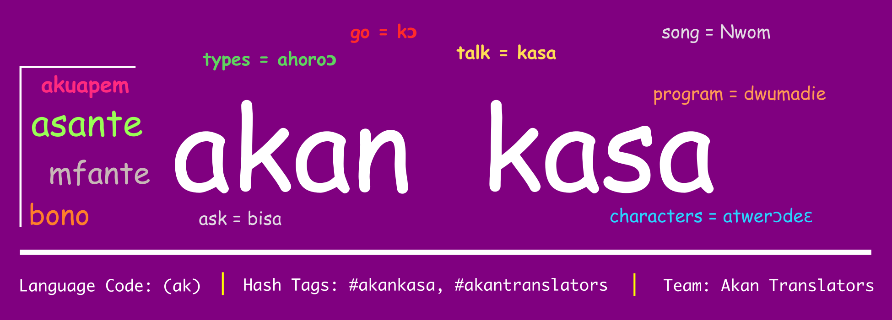

# Twi Translation Guide

## This project is part of [Open Twi](https://github.com/aberba/open-twi/) initiative

Welcome to a translation guide from `Twi Translators`. This is a basic guide for translating any text content into Twi using common conventions.

> **Twi** is commonly spoken in Ghana: a country in West Africa. Although twi is just one of the many local languages spoken in Ghana, it is very popular and almost everywhere you go, you are likely to find someone who speaks or understand the language. (The national language of Ghana is English).

> - **Why Twi?** Even though twi is commonly spoken in Ghana, it rare to find softwares, documentations, or technologies using the language. Hopefully this guide may serve as a basic reference for translating stuff into twi to make them accessible to many locals.
> - Although there are many variants of the twi, this guide will prefer the _Asante twi_ where possible to ensure consistency.
> - __NOTE__: Some people refer to Twi as Akan which is rather the name for those tribes who speak Twi.

## Contents Outline

- [Language Properties](#language-properties)
- [Projects using this guide](#projects)
- [List of twi Characters](#akan-characters)
- [Months in twi](#months)
- [Days in twi](#days)
- [List of common terms and their twi translations](#terms)

## Language Properties

Item              | Value                                    | Remark
----------------- | ---------------------------------------- | ---------------------------------------------
Language Name     | Akan (actually it is supposed to be twi) | -
Country of origin | Ghana                                    | Also spoken in parts of Togo and Cote D'voire
ISO 300 Code      | aka                                      | -
Plural Forms      | nplurals=2; plural=(n > 1);              | -

## List of Twi Translation Projects

- [elementary OS Twi Translation Guide](https://github.com/laberba/elementaryOS-twi-guide): A project aimed at translating [elementary OS](https://elementary.io) into twi.
- [Gnome Twi Translation Guide](https://github.com/laberba/gnome-twi-translation-guide): A project aimed at translating the [Gnome Desktop and Software Stack](https://gnome.org) into Twi.

## List of Twi Characters.

Upper-case | Lower-case | Sample Words(s) or Phrase
---------- | ---------- | -------------------------
Ɛ          | ɛ          | Ɛdin, Intanɛt
-          | έ          | Sέ anka wopɛ sɛ wo bue?
Ɔ          | ɔ          | Ɔgya, Bɔ nnwom
...        | ...        | Bue wɔ ...
à          | ã         | Fã, Mã
Á          | á          | Ná mentumi nhu
É          | é          | -
Ũ          | ũ          | Mũ
Õ          | õ          | -
Ĩ          | ĩ          | Yi fĩ no nyinaa
®          | -          | ® Original Inc.

## Months in Twi

English   | Twi
--------- | ----------------------------
January   | ɔpɛpɔn
February  | ɔgyefuo
March     | ɔbɛnem
April     | Oforisuo / Oforisuo Agyenkɔ
May       | Kotonimaa / Ohawam Kotonimaa
June      | Ayɛwohomumu Ayɛwohomɔmɔ
July      | Kutawonsa
August    | Sanaa
September | Ɛbɔ
October   | Ahinime
November  | Obubuo
December  | ɔpɛnimma

## Days in Akan

English   | Twi
--------- | --------
Sunday    | Kwasiada
Monday    | Dwowda
Tuesday   | Benada
Wednesday | Wukuda
Thursday  | Yawoada
Friday    | Fida
Saturday  | Memenda

## List of common terms and their twi translations

Each term has a marker such as **_(v)_**, **_(n)_**, **_(adj)_** indicating the term is either a **_nouns_**, **_verb_**, **_adjective_** respectively. Note that these translations are based in the context of computer science (Applying it in other context such as conversation, song, academic work, etc. may not be appropriate). See also [elementary OS translation-guide](https://github.com/laberba/elementaryOS-twi-guide)

English          | Twi Singular | Twi Plural        | Used in sentence or phrase                | Notice
---------------- | ------------ | ----------------- | ----------------------------------------- | -------------------------------------------------------------------
Internet (n)     | Intanɛt      | -                 | Kɔ `Intanɛt` so                           | -
Software (n)     | Dwumadi      | Dwumadi Ahoroɔ    | Bue computer so `dwumadi` bi              | This is in the context of computers as opposed to an event/occasion
Copy (v)         | Fa bi        | -                 | `Fa` file no bi                           | -
Cut (v)          | Fa           | -                 | `Fa` kɔ baabi foforɔ                      | -
Delete (v)       | Yi           | -                 | `Yi` file no firi kɔmputa no so           | -
Paste (v)        | Fa to ha     | -                 | `Fa` file no `to ha` (paste file here)    | Avoid direct translation])
Information (n)  | Nsɛm         | Nsɛm Ahoroɔ       | Hwɛ file no ho `nsɛm`                     | -
Open (v)         | Bue          | -                 | `Bue` file no                             | -
Dialog (n)       | Pono         | -                 | Yi kɔkɔbɔ pono no                         | -
Requirement (n)  | Ahwehwɛdeɛ   | Awehwɛdeɛ Ahoroɔ  | - Dwumadi no `ahwehwɛdeɛ`                 | -
Settings (n)     | Nhyehyɛe     | Nhyehyɛe Ahoroɔ   | Hwɛ dwumadi no ho `nhyehyɛe`              | -
Changes          | Nsakrae      | Nsakrae Ahoroɔ    | Kora `nsakrae` no so                      | -
Search (v)       | Hwehwɛ       | -                 | -                                         | -
Suspend (v)      | Twe san      | -                 | -                                         | -
Pause (v)        | Gyina (v)    | -                 | -                                         | -
View (v)         | Hwɛ          | -                 | -                                         | -
Machine          | Afidie       | Mfidie            | Sɔ afidie no                              | -
Save             | Kora         | -                 | -                                         | -
Indicator        | Ahyensodeɛ   | Ahyensodeɛ Ahoroɔ | -                                         | -
Notification     | Kɔkɔbɔ       | Kɔkɔbɔ Ahoroɔ     | -                                         | -
Click (n)        | Klik         | Klik Ahoroɔ       | -                                         | -
Click (v)        | Klike        | -                 | `Klicke` HOME afã hɔ                     | -
Website          | Wɛbsaet      | Wɛbsaet Ahoroɔ    | Kɔ yɛn `wɛbsaet` hɔ                       | -
Contact (v)      | Di Nkitaho   | -                 | Wo ne yɛn `nni nkitaho` wɔ user@gmail.com | -
Alert Dialog (n) | Kɔkɔbɔ Pono  | -                 | -                                         | -
Wire (n)         | Waya         | -                 | Twa waya no so                            | -
Address          | Adrɛs        | -                 | -                                         | -
Learn (v)        | Sua          | -                 | Sua ade wɔ intanɛt so                     | -
Phone (n)        | Fon          | Fon Ahoroɔ        | Gye yɛn `fon` number                      | -
Telephone (n)    | Tɛlefon      | Tɛlefon Ahoroɔ    | Frɛ yɛn wɔ `tɛlefon` so                   | -
-                | -            | -                 | -                                         | -
-                | -            | -                 | -                                         | -
-                | -            | -                 | -                                         | -
-                | -            | -                 | -                                         | -
-                | -            | -                 | -                                         | -
-                | -            | -                 | -                                         | -
