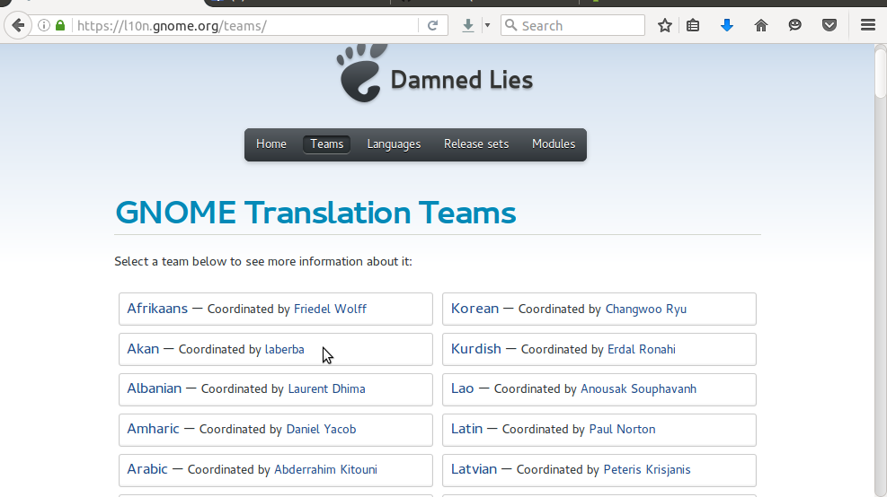

# Gnome Akan Translation Guide

Welcome to a translation guide from `Akan Translators`. This guide is meant to guide you to learn how you can help translate the `Gnome Software Stack` to `Akan` language.

***
### Side Notes
* **Akan Translators** is a team of people who help translate softwares, books, documentations, and other information to the Akan language, mostly `Libre`. For more information, visit us at:
    * Mailing List:
    * Launchpad:
    * Facebook:
    * Google+:
    * Social Media Hash-tag: #akantranslators
    *
* **Akan** (ak) is a language spoken by the people of Ghana: a country in West Africa. Although Akan is just one of the many local languages spoken in Ghana, is very popular and almost everywhere you go in Ghana, you are likely to find someone who speaks or understand the language. (The national language of Ghana is English).
* **Why Akan?** Even though the Akan language is popularly spoken in Ghana, it very difficult to find softwares, documentations, or technologies using the Akan language. Helping translate Gnome Software stack into Akan may help make this software accessible to many local people.
* **Gnome Software Stack** in this context refers to the softwares and other technologies developed by the [Gnome Foundation](gnome.org), [Gnome Community](community.gnome.org) and other hardworking people. These softwares stack is used to develop the Linux OS and other application, mostly for [Free and Open Source Software](gnu.org).
***

# Contents
* Introduction to the Translation Process
    * How translation work
    * Creating and account at `Deam Lies` (Gnome Translation Website)
    * Learning about the translation website and project releases
    * Translation tools and resources
    * Setting up your computer for translation
* Beginning Translation
    * Choosing a project to contribute
    * Getting .pot and .po files
    * Translation process
    * Submitting translate .po files
